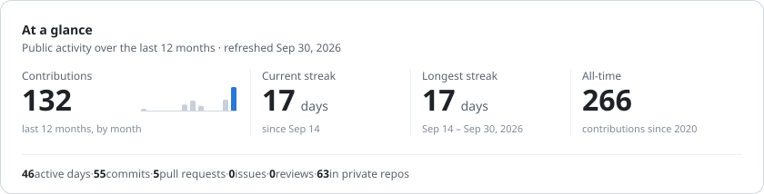
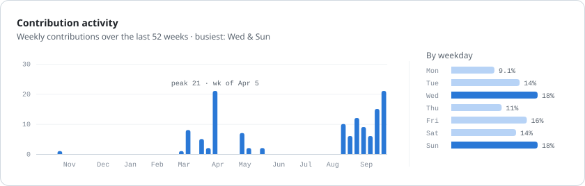
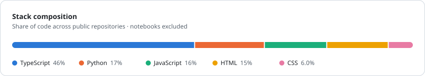
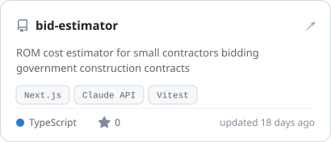
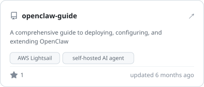
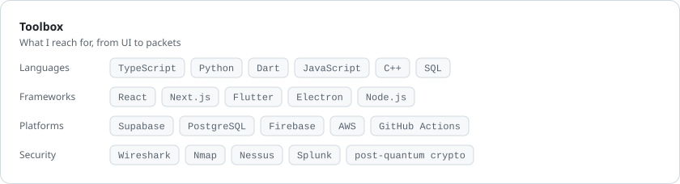

<!-- Cards in assets/ are rendered by scripts/build.mjs and refreshed daily by .github/workflows/profile-cards.yml -->

<picture>
  <source media="(prefers-color-scheme: dark)" srcset="assets/hero-dark.svg">
  
</picture>

<picture>
  <source media="(prefers-color-scheme: dark)" srcset="assets/overview-dark.svg">
  
</picture>

<picture>
  <source media="(prefers-color-scheme: dark)" srcset="assets/activity-dark.svg">
  
</picture>

<picture>
  <source media="(prefers-color-scheme: dark)" srcset="assets/languages-dark.svg">
  
</picture>

  <a href="https://github.com/WestphalianFresco/bid-estimator"><picture>
    <source media="(prefers-color-scheme: dark)" srcset="assets/project-bid-estimator-dark.svg">
    
  </picture></a>
  <a href="https://github.com/WestphalianFresco/openclaw-guide"><picture>
    <source media="(prefers-color-scheme: dark)" srcset="assets/project-openclaw-guide-dark.svg">
    
  </picture></a>

<picture>
  <source media="(prefers-color-scheme: dark)" srcset="assets/toolbox-dark.svg">
  
</picture>

<b>Numbers behind the cards</b>

<!-- stats:start -->
| Metric | Value |
| --- | --- |
| Contributions, last 12 months | 132 |
| Active days, last 12 months | 46 |
| Current streak | 17 days |
| Longest streak | 17 days |
| All-time contributions (since 2020) | 266 |
| Commits / PRs / issues / reviews | 55 / 5 / 0 / 0 |
| Contributions in private repos | 63 |

| Language | Share |
| --- | --- |
| TypeScript | 47% |
| Python | 18% |
| HTML | 16% |
| JavaScript | 12% |
| CSS | 6.2% |

| Mon | Tue | Wed | Thu | Fri | Sat | Sun |
| --- | --- | --- | --- | --- | --- | --- |
| 9.1% | 14% | 18% | 11% | 16% | 14% | 18% |

Last refreshed 2026-09-30 · public data only
<!-- stats:end -->

